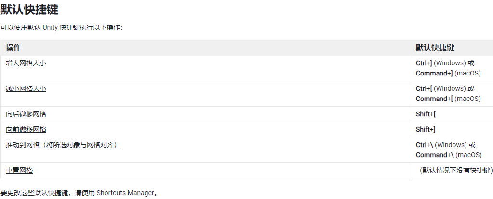

# Unity3D笔记

​	在Unity中创建Editor文件夹  里面的脚本不会被打包,且不能被游戏物体挂载,适用于编辑器脚本(例如项目中的图片资源自动转化格式,增加编辑器功能等).

​	对于一些全屏img图片,可能不需要Raycast Target(光线投射目标) 来监听鼠标是否进行点击,来进行优化.

​	在进行拼UI的步骤的时候 如果有成品图 可以直接将成品图拖到项目中,覆盖UI,然后调成半透明形式,进行对比.

​	关于有延迟的网络消息 可以写一个专门的方法来进行后续处理，方法写在调用网络消息的类里面。

​	关于按钮点击，可以直接把游戏对象拖到里面，就有一些基本的功能，比如SetActive  Trans等

​    ScriptableObject   无需被游戏对象附加，依旧可以使用Awak-Destroy需要依附游戏对象的脚本,适合做一些服务类，以及扩展编辑器

​	下面是一个继承于ScriptableObejct的一个编辑器扩展实例。

​	SpriteEditor：左上角点击自动裁剪之后，可以通过拉动蓝框精细裁剪，点击右上角的RGB按钮，则可以变成黑白曝光模式。更好分辨图片，裁剪完毕后，点击一张图片即可调整图片中心点位置。

​	鼠标监听的内置方法OnMouse系列【需要Collider组件】，游戏对象使用，UI组件请使用接口监听或者EventTrigger组件【能够监听鼠标事件的Button】，在鼠标Input中MouseDown表示按下，Up表示抬起，可表示是否选中该对象。

​	鼠标的【InputMousePosition】是屏幕坐标系，屏幕左下角为（0，0），右上角为（1920，1080）即屏幕分辨率。

​	在脚本界面中，按下Ctrl+Shift+M 打开内置方法搜索框【应该是IDE带的功能】

​	UI组件【Canvas Group】 可以调整透明度。

​    position是根据世界原点为中心,localPosition是根据父节点为中心,如果没有父节点,localpositon和position是没有区别的。

​	将多个图片直接拖入场景，Unity会直接生成帧动画。

​	父物体继承子物体的碰撞。

​	FixUpdate放一些不能受硬件影响的方法更新【例如：人物移动】 Update则放一些相对于不太重要的方法更新【例如：UI刷新】

​	两个2d对象的相互Trigger2D 必须且只需一个对象需要is Trigger模式【碰撞盒】

​	可以在Unity->Edit->项目选项中，设置Physics/Physics2D中哪些图层与图层之间需要碰撞或者不碰撞。

​	AssetDatabase.LoadAssetAtPath读取只能从项目路径开始读取，不能使用Application.dataPath从盘符开始读取

​	关于图层问题，如果人物和地图处于相同图层，动画可能出现闪烁。是因为最上层图层不确定，在随机显示地图和人物。

​	

## 	UnityAPi

```c#

Vector2 pos=Camera.Main.ScreenToWorld（屏幕坐标系）//通过此方法可以把屏幕坐标系转化为世界坐标系。
Vector.Distance(vec1,vec2)//计算两个坐标的距离【较为消耗性能，谨慎使用！】
Input.Touch//该系列为触摸输入 通过枚举来判断触摸行为
OnMouseDrag==if(coilider2D==Physic2D.OverLapPonit(屏幕坐标系))
    
//简单的重新加载场景的方式【不用每次都要播放和结束播放】
private void Update()
{
   //按下任意按键 
  if (Input.anyKeyDown)
  {
   	//重新加载场景           //参数：当前场景名
   	SceneManager.LoadScene(SceneManager.GetActiveScene().name);
  }
}
```

碰撞盒勾选是触发器【就会当做是一个脚本触发范围，不会被碰撞】

## 有关于2D游戏的小技巧

​	Edit->Grid and Snap->Increment Snap 可以调整鼠标移动物体时的大小【需要按住Ctrl键】，在制作2D游戏的时候，可以更好的一块块贴合瓦片素材。设置网格的大小【Grid Visuals】，还能一键优化场景中所有素材的的位置【Align Selection to Grid】，2D游戏必备，强迫症必备！以下是默认快捷键



 	素材处理方面【像素游戏】，每单位像素数设置为素材的分辨率，过滤模式设置为点（无过滤器，无需处理），最大尺寸按需求定制。

基本的移动 2d的图片翻转

```c#
private void Update()
{
       float moveH = Input.GetAxis("Horizontal")*moveSpeed;
       float moveV = Input.GetAxis("Vertical")*moveSpeed;
       Flip();
}

private void FixedUpdate()
{
    	//通过刚体组件移动
        rb.velocity = new Vector2(moveH, moveV);
}
private void Flip()
{
        //利用向量进行翻转图片进行转向
        if (moveH>0)
        {
            transform.eulerAngles = new Vector3(0, 0, 0);
        }
        if(moveH<0)
        {
            transform.eulerAngles = new Vector3(0, 180, 0);
        }
}
```


## Unity常用属性声明

```c#
//扩展创建菜单  第一个参数为创建出来的文件名  后面为该功能键的路径  order越大越往后排
[CreateAssetMenu(fileName ="New Item",menuName ="背包内容/新物品创建",order=0)]
public class Item : ScriptableObject 
    
//扩展工具栏 必须为静态方法 点击后执行 脚本最好写在Editor文件夹下 无需打包的内容
[MenuItem("Tools/Packaging")]
public static void Bulid()

//序列化一个类
[Serializable]
public class SerilizeStudy
//添加XML属性标签进行序列化【需要先序列化类】
[XmlAttribute("ID")]
public int ID { get; set; }
//序列化字典列表等
[XmlArray("List")]
或
[XmlElement("List")] 
public List<int> IDLst;


[SerialiceField] //私有变量也可以在场景中调整
[Header("房间信息")]//可以在可视化界面中提供变量说明  
[Serializable]//未挂载MonoBehaviour的脚本被创建后也可在可视化界面中显示
[RequireComponent(typeof(Rigidbody2D))] //此声明可以强制让依赖对象拥有Rigidbody2D组件，如果没有则会强制添加上去【写在Mon上面（类上面）】 
[HideInInspector]public bool isAttacked;//可以在可视化界面中隐藏Public变量


```

## Unity编辑器内的弹窗提示

```c#
 //创建提示窗口 “确定”就是返回true
if (EditorUtility.DisplayDialog("打包信息", msg, "确定", "取消"))
{
//检测路径是否存在，如果不不存在则创建
if (!Directory.Exists(path)) Directory.CreateDirectory(path);
//打包进度条
EditorUtility.DisplayProgressBar("信息", "正在打包资源包", 0f);
//开始打包
BuildPipeline.BuildAssetBundles(path, options, platform);
 //刷新编辑器资源
AssetDatabase.Refresh();
//tip弹窗提示
EditorUtility.DisplayDialog("提示", "打包AssetBundle完毕", "确定");
}
```

