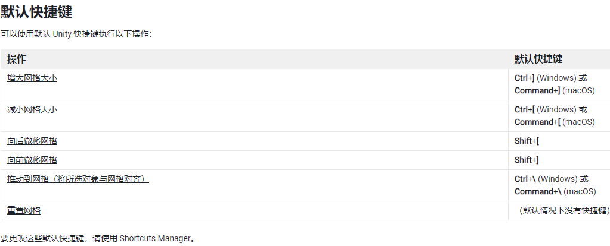

### Unity3D笔记

​	在Unity中创建Editor文件夹  里面的脚本不会被打包,且不能被游戏物体挂载,适用于编辑器脚本(例如项目中的图片资源自动转化格式,增加编辑器功能等).

​	对于一些全屏img图片,可能不需要Raycast Target(光线投射目标) 来监听鼠标是否进行点击,来进行优化.

​	在进行拼UI的步骤的时候 如果有成品图 可以直接将成品图拖到项目中,覆盖UI,然后调成半透明形式,进行对比.

​	关于有延迟的网络消息 可以写一个专门的方法来进行后续处理，方法写在调用网络消息的类里面。

#### 有关于2D游戏的小技巧

​	Edit->Grid and Snap->Increment Snap 可以调整鼠标移动物体时的大小【需要按住Ctrl键】，在制作2D游戏的时候，可以更好的一块块贴合瓦片素材。设置网格的大小【Grid Visuals】，还能一键优化场景中所有素材的的位置【Align Selection to Grid】，2D游戏必备，强迫症必备！以下是默认快捷键

